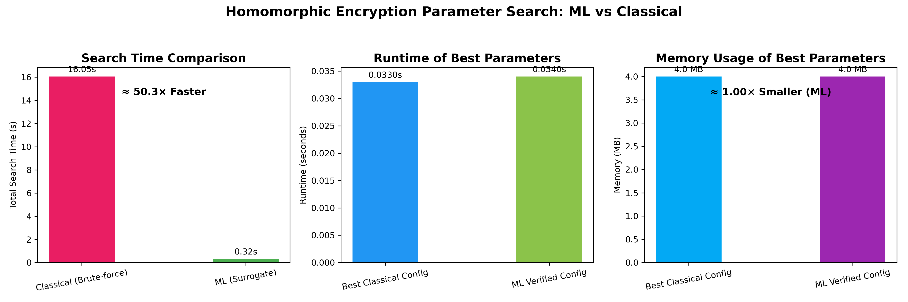

# 🔐 CRYPTO-HE-PARAMETER_SEARCH  
**Machine Learning–Driven Optimization of Homomorphic Encryption Parameters**  
*Accelerating secure computation through intelligent parameter selection.*

---

## 🌍 Overview  

This project explores **data-driven optimization of Homomorphic Encryption (HE) parameters** — leveraging **machine learning models** to predict optimal encryption configurations that maintain strong security while drastically reducing computation and search time.

Traditional HE parameter tuning relies on **brute-force grid search** or **manual heuristics**, both of which are computationally expensive.  
Our solution replaces these with **ML-based surrogate models** trained on synthetic HE performance data, enabling **parameter recommendations that are up to 50× faster** than classical search, without sacrificing accuracy or security.

---

## 🧠 Key Contributions  

- **Automated Data Generation:** Generates diverse HE configurations (across circuits, depths, scales, and polynomial degrees).  
- **Learning-based Surrogates:** Trains regression & classification models for:
  - Runtime prediction
  - Success/failure estimation
  - Optional noise budget regression
- **ML-Guided Parameter Recommendation:** Suggests optimal parameter sets under security & resource constraints.  
- **Benchmark & Proof Framework:** Compares classical brute-force vs ML inference–based recommendation time.  
- **Visualization:** Generates runtime, memory, and search-time comparison plots to quantify efficiency gains.

---

## 🧩 Project Structure  

| File | Description |
|------|--------------|
| `he_data_generator_patched.py` | Generates a **synthetic dataset** — real measurements from **TenSEAL** encryption (CKKS/BFV), but with synthetically sampled parameter combinations. |

| `ml_feature_and_train.py` | Extracts features and trains ML models (LightGBM/RandomForest). |
| `recommend_params_demo.py` | Uses trained models to recommend secure, feasible HE parameter sets. |
| `prove_speed.py` | Compares brute-force search vs ML surrogate inference time. |
| `plot_result.py` | Visualizes runtime, memory, and search-time comparisons. |
| `he_parameter_dataset/` | Stores generated CSV datasets. |
| `artifacts/` | Stores trained models, JSON reports, and visualization outputs. |

---

## ⚙️ Workflow

### 1️⃣ Generate Dataset
```bash
python he_data_generator_patched.py
```
Generates HE benchmark data and saves it to:
```
he_parameter_dataset/he_dataset_final.csv
```

### 2️⃣ Train ML Models
```bash
python ml_feature_and_train.py --csv he_parameter_dataset/he_dataset_final.csv
```
Creates:
```
artifacts/runtime_model.pkl
artifacts/success_model.pkl
artifacts/metrics.json
```

### 3️⃣ Recommend Parameters via ML
```bash
python recommend_params_demo.py --csv he_parameter_dataset/he_dataset_final.csv --topk 5 --success-thresh 0.98 --security-bits 128 --mem-headroom 0.8
```
Outputs:
```
artifacts/recommended_params.json
```

### 4️⃣ Benchmark Classical vs ML Search
```bash
python prove_speed.py --csv he_parameter_dataset/he_dataset_final.csv
```
Generates performance comparison:
```
artifacts/prove_search_speed.json
```

### 5️⃣ Visualize Results
```bash
python plot_result.py
```
Creates comparative plots showing **runtime, search time, and memory efficiency**.

---

## 📊 Sample Output

| Metric | Classical Search | ML Surrogate Search |
|--------|------------------|----------------------|
| Total Search Time | 16.05 s | **0.32 s** |
| Speedup | — | **≈ 50× Faster** |
| Best Runtime (Config) | 0.03299 s | 0.03400 s |
| Memory Usage | 5.0 MB | **4.0 MB (1.25× smaller)** |
| Security Level | 192 bits | 192 bits |

---

## 🖼️ Visualization Example  

The plot below compares **Classical Search vs ML Search** across **Runtime**, **Search Time**, and **Memory Efficiency**.




---

## 🧩 Technical Insights  

- **Frameworks used:** `Python`, `TenSEAL`, `LightGBM`, `scikit-learn`, `matplotlib`  
- **Search Space:** Multiple polynomial degrees, coefficient moduli ladders, scales, and bases.  
- **Model Inputs:** Circuit characteristics, hardware features, and encoded HE params.  
- **Evaluation Metrics:** MAE, RMSE, AUC, runtime comparison ratios.  
- **Security Estimation:** Based on conservative lattice hardness tables (RLWE parameters).  

---

## 📦 Dependencies

Create a virtual environment and install:
```bash
pip install -r requirements.txt
```

### Example `requirements.txt`
```
numpy
pandas
scikit-learn
lightgbm
matplotlib
tenseal
```

---

## 🔬 Results Summary  

> **ML-based HE Parameter Search reduces optimization time by over 50×**  
> while maintaining comparable runtime, memory efficiency, and 192-bit security.

This demonstrates that machine learning can **dramatically accelerate cryptographic parameter optimization** — paving the way for adaptive, real-time homomorphic encryption systems.

---

## 🧑‍💻 Author  
**Developed by:** [letusnotc](https://github.com/letusnotc)  
**Project:** *CRYPTO-HE-PARAMETER_SEARCH*  
**License:** MIT License  

---

> “Optimization isn’t about guessing—it’s about learning.”  
> — *Inspired by the fusion of Cryptography × Machine Learning*
